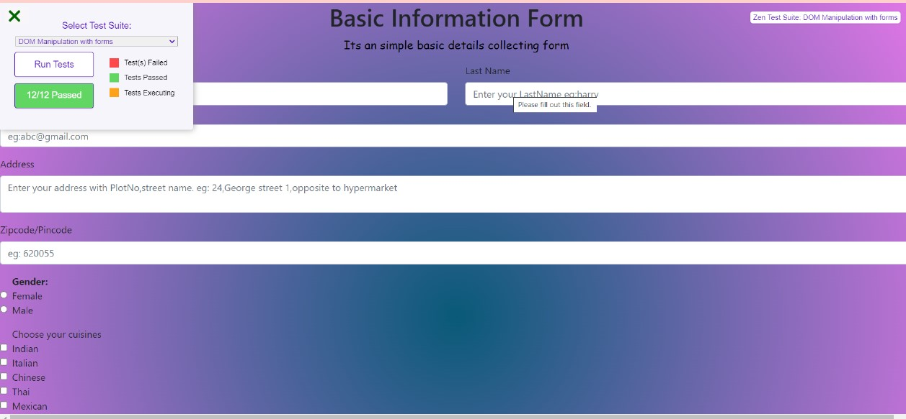

<h1>Basic Information Form</h1>

Created the DOM to get the use basic infos . used validations for some fields

<h3>Learned</h3>
<ul>
  <il>Pageholder</il>
   <il>column split</il>
   <il>input types</il>
  <il>bootstrap classes</il>
  <il>Accessing checkbox values</il>
</ul>
<h2>And my output will be</h2>

